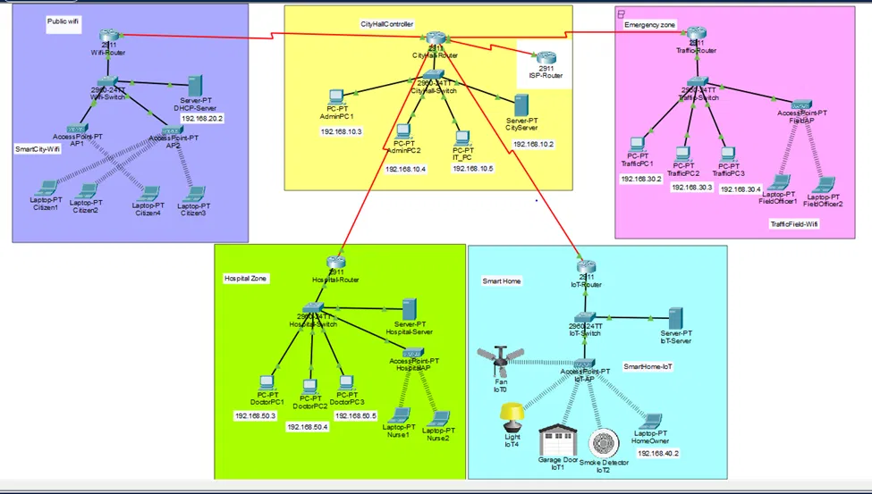

# Hi there, I'm Fatima 👋

### BSSE Student | Air University Islamabad | Aspiring Frontend Developer

---

## 🚀 About Me
- 🎓 Bachelor of Software Engineering — Air University, Islamabad
- 💻 Passionate about Frontend Development and building real-world solutions
- 🌱 Currently mastering: C++, OOP, Git/GitHub, HTML/CSS
- 📢 Running a 30-day OOP learning series on LinkedIn
- 📍 Islamabad, Pakistan

---

## 🛠️ Skills

---

## 📂 Featured Projects

### 🍱 FoodRescue.pk
> Islamabad's first verified food rescue platform — connecting food donors with NGOs to fight hunger.
- Built the mobile module using Django
- Figma UI/UX design for web and mobile
- Tackles SDG 2 (Zero Hunger) and SDG 12.3 (Food Waste)

🔗 [View Repo](https://github.com/fatimabibi7020-cell/FoodRescue-pk) | [Mobile Module](https://github.com/fatimabibi7020-cell/FoodRescue-Danjo)

---

### 🎪 OOP Event Management System
> A console-based event management system built using Object Oriented Programming principles in C++.
- Applies classes, inheritance, polymorphism, and file handling
- Built as part of OOP coursework at Air University

🔗 [View Repo](https://github.com/fatimabibi7020-cell/OOP-Event-Management-System)

---

### 🏙️ Smart City Network — Cisco Packet Tracer

> A complete smart city network topology designed in Cisco Packet Tracer.
- Includes Public WiFi, City Hall, Hospital Zone, Smart Home, and Emergency zones
- Configured routers, switches, DHCP servers, and IoT devices
- Built for Computer Networks coursework at Air University

---

## 📊 GitHub Stats

---

## 🤝 Connect With Me

---

⭐ *Currently on a 30-day OOP learning journey — follow along on LinkedIn!*
